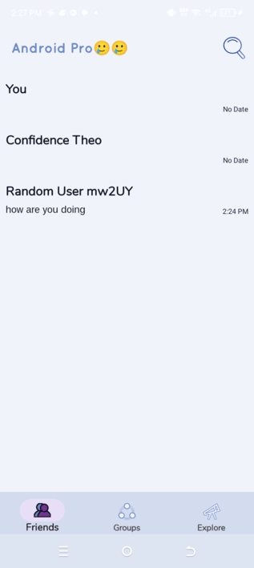

# Thio Chat
**An Android Chat App made with Firebase Firestore and Authentication**

https://github.com/user-attachments/assets/cce0f89b-becb-442d-8309-25c58106b031

# Introduction
 The app uses Firebase Firestore and Authentication , and is based on MVVM design pattern and follows Clean Architecture Principles.  
## Features

- **Real-time Messaging** – Send and receive messages instantly.
- **User Authentication** – Secure login and registration.
- **Profile Management** – Update profile information and status.
- **Dark Mode Support** – Toggle between light and dark themes.
- **Multi-user Chats** – Support for group conversations.

## ScreenShoots

    
    
    
    
    

## Architecture

The project follows the **MVVM** pattern combined with **Clean Architecture**, ensuring separation of concerns and modularity.

### Layers

1. **Presentation Layer** – Contains UI components and ViewModels.
2. **Domain Layer** – Includes use cases and business logic.
3. **Data Layer** – Manages repositories, API calls, and database operations.

### Tech Stack

- **Kotlin** 
- **XML** – UI framework 
- **Hilt** – Dependency Injection
- **Retrofit** – API communication
- **Room Database** – Local storage
- **Firebase Firestore** – Real-time messaging backend and database
- **Firebase Authentication** – Authentication
- **Coroutines & Flow** – Asynchronous programming
- **Jetpack Navigation** – Navigation component
- **ViewModel &  StateFlow** – State management

## Contributing

Contributions are welcome! Feel free to fork the repository, create a new branch, and submit a pull request.

## Contact

For any issues or feature requests, please open an issue or reach out to me at [gabrielukpehdev@gmail.com].

